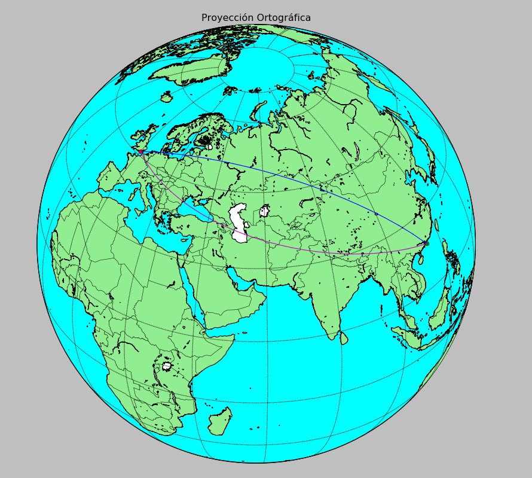
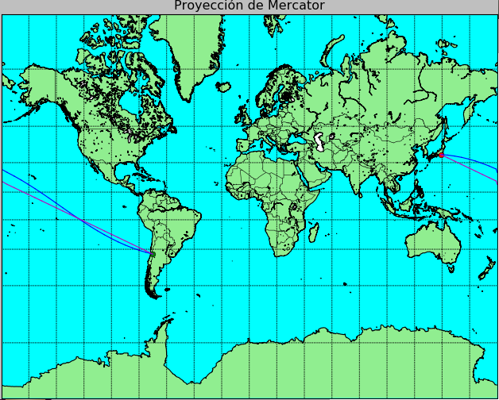
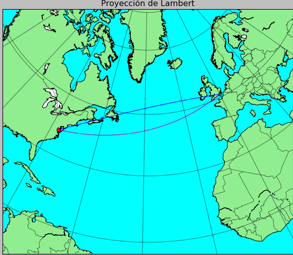
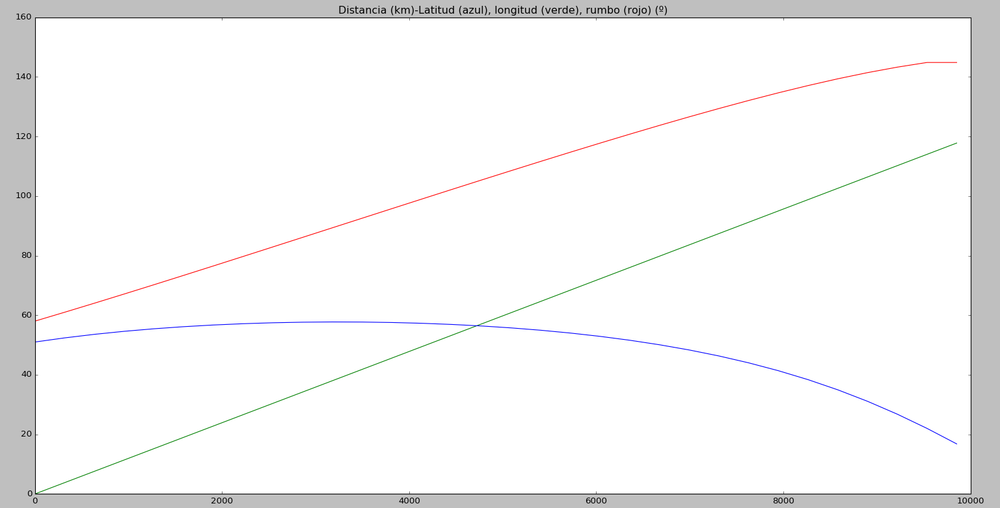

# Open-Flight-Route-Calculator (OFRC.py)

__author__ = ["Alberto de Celis Romero, Eduardo Gil Rodríguez, Enrique Olvera Ruíz, Qiang Yang"]

__credits__ = ["Pablo Moreno García"]

__license__ = "GNU GPLv3"

__version__ = "1.0.0"

__maintainer__ = "Alberto de Celis Romero, Eduardo Gil Rodríguez, Enrique Olvera Ruíz"

__email__ = "alberto.decelisro@alum.uca.es, eduardo.gilrodriguez@alum.uca.es, enrique.olveraruiz@alum.uca.es"

__status__ = "Production"

Software designed for the calculation and plot of aviation routes (orthodromic and loxodromic routes), given two coordinates and a projection.

This program has been developed with academic intends. It is not recommended using it with other purposes.

It calculates ortodromic and loxodromic routes between two given points in the world and will plot them in a selected projection.

At first, the program would ask the user two options: 1 (One) to enter in a 50 airports database; 2 (Two) for the user to give the exact coordinates of the origin and destination.
Once this step is done, it comes to choose the type of projection. Currently there are 6 of them to choose:
1. (One) for Mercator 
2. (Two) for Ortographic 
3. (Three) for Lambert 
4. (Four) for Cylindrical Equidistant 
5. (Five) for Estereographic
6. (Six) for Azimutal Equidistant

Whether it is not written a valid number, this question will be repeating itself until it is introduced. 

In a more specific topic, the code is programmed in a way that the longitude is being increased to the right (just for no special reason).

At the time of introducing coordinates, North and East are positive, with their value in degrees (with decimals).

Some point you can test are:
Madrid 40N 6W, Tokyo: 35N 139E, Chile 33S 70W.

The expected output is a map with the plotted routes, and once it is closed, a graph which prints latitude, longitude and heading versus distance.

The libraries needed are: mpl_toolkits, matplotlib, math, os and numpy.

EXAMPLES:

